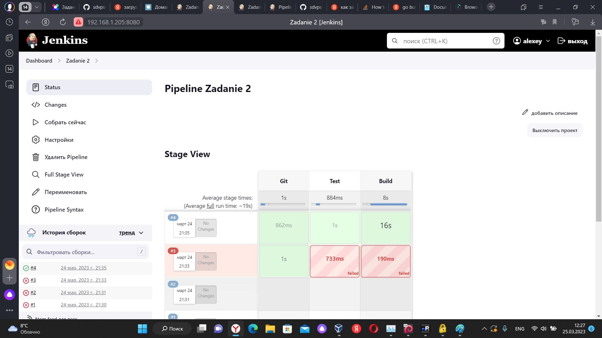

# Домашнее задание к занятию "`«8.2. Что такое DevOps. СI/СD»`" - `Дьяконов Алексей`

### Задание 1

# Настройки:
 -

# Результат выполнения:
 -

### Задание 2

# Настройки:
 -

# Результат выполнения:
 -

### Задание 3

# Настройки:
 -

# Результат выполнения:
 -

# Загрузка в  Nexus:
-

 